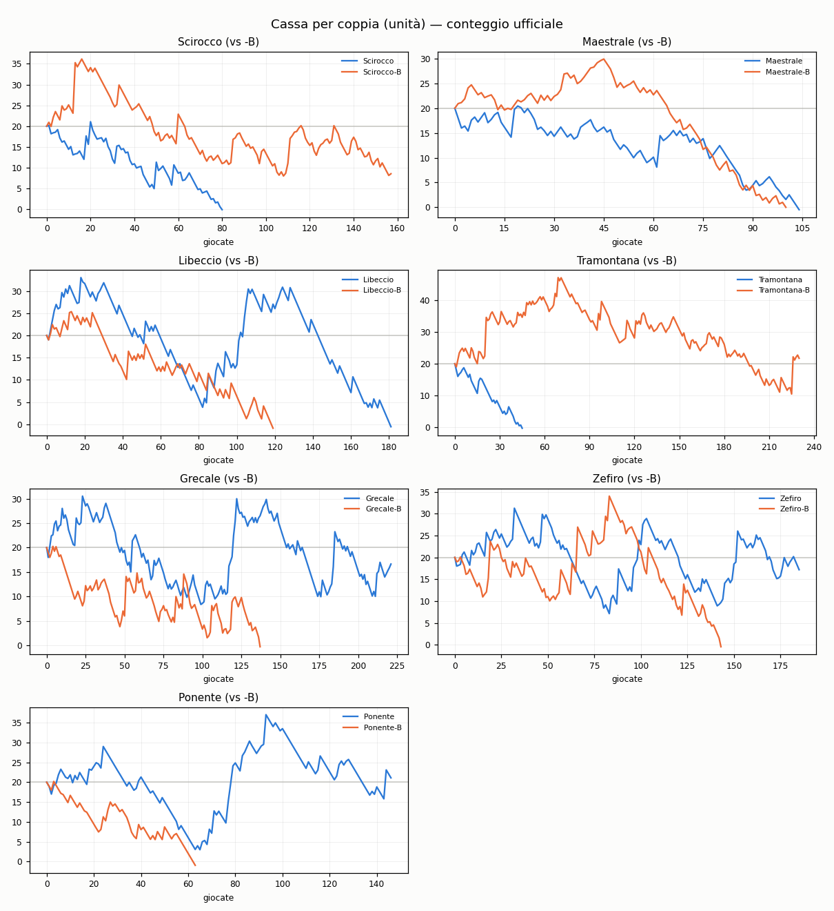
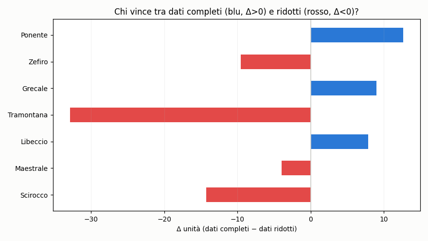

# Track record — corse ippiche UK/IRE

Registro pubblico e verificabile delle selezioni di **14 sistemi automatici**
(7 coppie), fase dal **15 al 31 luglio 2026**. Tutto in unità (u): nessun
importo reale.

## Come funziona la verifica

1. **Prima delle corse** pubblichiamo qui l'hash del file selezioni,
   timbrato con [OpenTimestamps](https://opentimestamps.org) sulla blockchain
   Bitcoin (`picks/*.json.ots` + `picks/hashes.txt`). Le selezioni restano
   segrete fino a fine fase.
2. **A fine fase** i file `picks/*.json` vengono pubblicati in chiaro:
   chiunque può ricalcolare l'hash (`sha256sum`) e verificare col timestamp
   (`ots verify <file>.ots`) che esistevano PRIMA delle corse.
3. Grafici e classifica si aggiornano automaticamente.

## Regole del gioco (uguali per tutti i sistemi)

- Posta fissa **1u** per selezione; LAY con **liability massima 2u** (oltre
  quota 3.00 la posta si riduce per non superare il cap).
- Cassa iniziale **20u** per sistema.
- **Stop giornaliero −10u**: le selezioni successive della giornata non
  contano nel conteggio ufficiale; si riparte l'indomani.
- **Stop di fase −20u**: definitivo, il sistema si ferma.
- P/L netto di commissione exchange 6,5%, quote snapshot al momento della
  selezione (mercato WIN, corse UK/IRE).

## I sistemi

7 coppie: ogni sistema esiste in due varianti — **nome pieno** (dati completi)
e **nome-B** (dati ridotti). Stesso motore decisionale, meno informazioni in
ingresso: l'esperimento misura quanto valgono i dati extra.

Una delle 14 serie è giocata con **denaro reale** (stesse regole, stessa
scala in unità). Non indichiamo quale.

## Grafici

### Come leggere i grafici

- **Asse verticale:** cassa in **unità** (u). Ogni sistema parte da **20u**;
  sopra 20u è in utile, sotto è in perdita.
- **Asse orizzontale:** le giocate nel tempo (una tacca per selezione).
- **Blu** = versione a **dati completi**; **arancione (-B)** = **dati ridotti**.
  Nel singolo riquadro il confronto è l'esperimento: blu sopra = i dati extra
  aiutano; arancione sopra = non aiutano (o danneggiano).
- **Riferimenti:** 20u = pari; stop giornaliero a 10u; stop di fase a 0u (fermo).
- **Attenzione:** poche giornate = **rumore**, non un trend. Le conclusioni si
  traggono a fine fase (31/7).
## Come vanno le coppie

_Poche giornate: numeri ancora rumorosi, si conclude a fine fase (31/7)._

- **Scirocco**: dati ridotti avanti di 19,3u — qui gli extra non aiutano
- **Maestrale**: dati ridotti avanti di 14,0u — qui gli extra non aiutano
- **Libeccio**: dati completi avanti di 8,8u
- **Tramontana**: dati ridotti avanti di 40,0u — qui gli extra non aiutano
- **Grecale**: dati completi avanti di 12,6u
- **Zefiro**: dati completi avanti di 4,4u
- **Ponente**: dati completi avanti di 6,7u

## Classifica (conteggio ufficiale)

| Sistema | Cassa (u) | P/L (u) | Selezioni | Escluse | Stato |
|---|---|---|---|---|---|
| Tramontana-B | 39,7 | +19,7 | 52 | 0 | 🟢 |
| Scirocco-B | 25,7 | +5,7 | 30 | 0 | 🟢 |
| Maestrale-B | 24,2 | +4,2 | 55 | 0 | 🟢 |
| Zefiro | 22,2 | +2,2 | 45 | 0 | 🟢 |
| Libeccio | 20,9 | +0,9 | 54 | 0 | 🟢 |
| Zefiro-B | 17,8 | -2,2 | 32 | 0 | 🟢 |
| Grecale | 17,4 | -2,6 | 51 | 3 | ⏸ |
| Ponente | 14,8 | -5,2 | 48 | 1 | ⏸ |
| Libeccio-B | 12,1 | -7,9 | 40 | 2 | ⏸ |
| Maestrale | 10,2 | -9,8 | 57 | 0 | 🟢 |
| Ponente-B | 8,0 | -12,0 | 40 | 2 | 🟢 |
| Scirocco | 6,4 | -13,6 | 46 | 6 | ⏸ |
| Grecale-B | 4,9 | -15,1 | 46 | 2 | 🟢 |
| Tramontana | 0,0 | -20,3 | 45 | 10 | 🛑 |

_Aggiornato: 16/07 22:51_
---
*Nessuna delle informazioni qui pubblicate costituisce consiglio di gioco.
Il gioco può causare dipendenza — 18+.*
